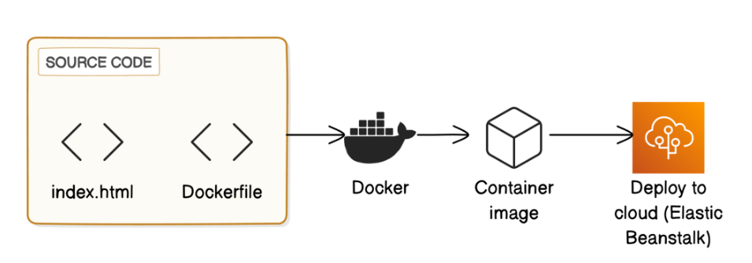

# Deploy-an-App-with-Docker

# 🚀 Containerize an App with Docker & Deploy on AWS Elastic Beanstalk

This project demonstrates how to containerize a simple web application using **Docker Desktop** and deploy it to **AWS Elastic Beanstalk** (PaaS for Docker containers).

---

## 🖼️ Preview

> Replace this image with a screenshot of your deployed app or architecture.

---

## 🧰 Tech Stack

- 🐳 Docker (via Docker Desktop)
- ☁️ AWS Elastic Beanstalk (Single Container)
- 🔐 Docker Hub (to host container image)

---

